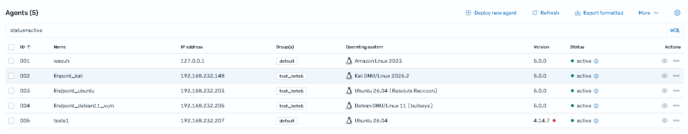
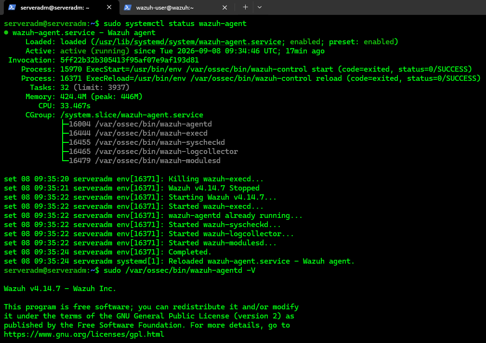
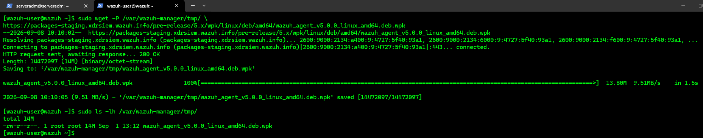
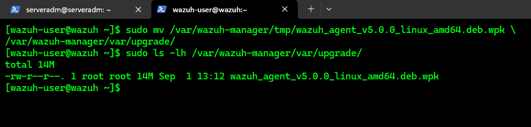
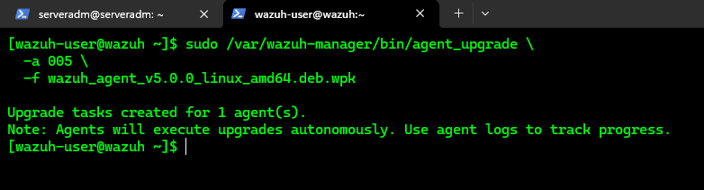
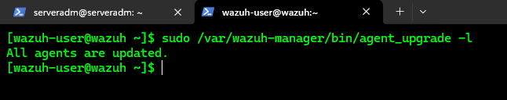
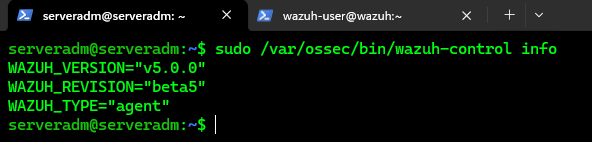
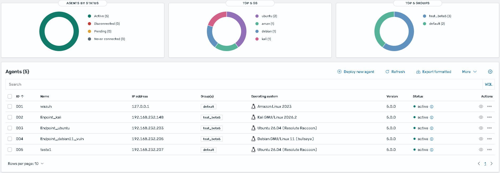

# Remote Upgrade of Wazuh Agents

## Overview

This procedure describes how to perform a **remote upgrade of Wazuh Agents** from the Wazuh Manager using a WPK (`Wazuh Package`) file.

In this lab environment, the Wazuh Manager is running **Wazuh 5.0.0**, while one of the registered agents is still running **Wazuh 4.14.7**.

The `4.14.7` agent will be used as the test subject for the remote upgrade to `5.0.0`.

---

## Current Environment

The Wazuh Dashboard currently shows the following agents:

| ID | Name | IP Address | Operating System | Version | Status |
|---:|---|---|---|---|---|
| 001 | wazuh | 127.0.0.1 | Amazon Linux 2023 | 5.0.0 | Active |
| 002 | Endpoint_kali | 192.168.232.148 | Kali GNU/Linux 2026.2 | 5.0.0 | Active |
| 003 | Endpoint_ubuntu | 192.168.232.203 | Ubuntu 26.04 | 5.0.0 | Active |
| 004 | Endpoint_debian11_vuln | 192.168.232.205 | Debian GNU/Linux 11 (Bullseye) | 5.0.0 | Active |
| **005** | **teste1** | **192.168.232.207** | **Ubuntu 26.04** | **4.14.7** | **Active** |

### Upgrade Target

The test will be performed against:

- **Agent ID:** `005`
- **Agent Name:** `teste1`
- **IP Address:** `192.168.232.207`
- **Operating System:** Ubuntu 26.04
- **Current Version:** Wazuh 4.14.7
- **Target Version:** Wazuh 5.0.0

### Upgrade Path

```text
Wazuh Agent 005
      |
      | Current version
      v
   Wazuh 4.14.7
      |
      | Remote Upgrade using WPK
      v
   Wazuh 5.0.0
      |
      v
   Active
```

---

## 1. Initial State

Before starting the upgrade, the target agent was verified in the Wazuh Dashboard.

The target agent is:

- **Agent ID:** `005`
- **Agent Name:** `teste1`
- **IP Address:** `192.168.232.207`
- **Operating System:** Ubuntu 26.04
- **Current Version:** Wazuh 4.14.7
- **Status:** Active



The agent is currently running Wazuh 4.14.7 and is successfully connected to the Wazuh Manager.

---

### 1.1 Verify Agent Status and Version

The Wazuh Agent service was verified before starting the upgrade.

```bash
sudo systemctl status wazuh-agent
```

```bash
sudo /var/ossec/bin/wazuh-agentd -V
```



---

## 2. Download the WPK Package

The WPK package required for the upgrade was downloaded from the Wazuh 5.0 Beta staging repository.

For this lab, the **Linux AMD64** package was selected because Agent 005 is running on an AMD64 architecture.

The WPK package used is:

```text
wazuh_agent_v5.0.0_linux_amd64.deb.wpk
```

### 2.1 Download the WPK File

The WPK package was downloaded to the Wazuh Manager using the following command:

```bash
sudo wget -P /var/wazuh-manager/tmp/ \
https://packages-staging.xdrsiem.wazuh.info/pre-release/5.x/wpk/linux/deb/amd64/wazuh_agent_v5.0.0_linux_amd64.deb.wpk
```

The downloaded package is:

```text
wazuh_agent_v5.0.0_linux_amd64.deb.wpk
```

### 2.2 Verify the WPK Package

The WPK file was verified in the Wazuh Manager temporary directory:

```bash
sudo ls -lh /var/wazuh-manager/tmp/
```



---

## 3. Prepare the WPK Package

```bash
sudo mv /var/wazuh-manager/tmp/wazuh_agent_v5.0.0_linux_amd64.deb.wpk \
/var/wazuh-manager/var/upgrade/
```
Confirm:

```bash
sudo ls -lh /var/wazuh-manager/var/upgrade/
```



---

## 4. Start the Remote Upgrade

The remote upgrade is performed using the `agent_upgrade` tool on the Wazuh Manager.

Agent `005` is selected as the upgrade target.

The following command is used:

```bash
sudo /var/wazuh-manager/bin/agent_upgrade \
  -a 005 \
  -f wazuh_agent_v5.0.0_linux_amd64.deb.wpk
```



The upgrade task was successfully created for Agent **005**.

---

## 5. Verify the Remote Upgrade

After creating the upgrade task, allow approximately **5 minutes** for the Wazuh Agent to complete the remote upgrade.

Once the upgrade process has had time to complete, verify the list of outdated agents on the Wazuh Manager:

```bash
sudo /var/wazuh-manager/bin/agent_upgrade -l
```


### 5.1 Verify the Agent Version

On Agent **005 (teste1)**, verify the installed Wazuh Agent version:

```bash
sudo /var/ossec/bin/wazuh-control info
```


### 5.2 Verify the Upgrade in the Wazuh Dashboard

Finally, open the Wazuh Dashboard and verify Agent `005`.

The agent should display:

- **Name:** `teste1`
- **IP Address:** `192.168.232.207`
- **Version:** `5.0.0`
- **Status:** `Active`



The remote upgrade from **Wazuh Agent 4.14.7 to 5.0.0** was successfully completed and verified from the Manager, the endpoint, and the Wazuh Dashboard.
